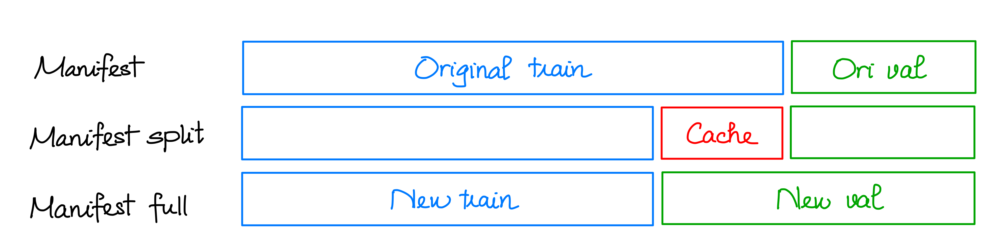

<div align="center">

# SinoNom recognition system

<a href="https://pytorch.org/get-started/locally/"></a>
<a href="https://pytorchlightning.ai/"></a>
<a href="https://hydra.cc/"></a>
<a href="https://github.com/ashleve/lightning-hydra-template"></a><br>
[](https://www.nature.com/articles/nature14539)
[](https://papers.nips.cc/paper/2020)

</div>

## Description

For the mid-term project of the Image Processing class 2324II_INT3404E_20, we are tasked with performing Sino-nom character recognition (classification) on a provided dataset of approximately 57,000 pictures of 2,130 different Sino-nom characters. 

We performed analysis and pre-processing of the data with various techniques, before inputting them through various pre-trained Deep Learning models for Computer Vision tasks. 

After training a set of models with potent accuracies, we ensembled them with different configurations to further enhance our accuracy score. Ultimately, our approach achieved a maximum score of 96.98% on the provided validation set, an improvement of roughly 35% over the accuracy of the baseline Convolutional Neural Network we chose.

You can further read about our approach at [here](https://drive.google.com/file/d/1yYT5MYsr2M9HmTXgOXbphyJ01GuruX6M/view?usp=sharing).

## Installation

### Environment
You can set up your environment with pip.

```bash
# clone project
git clone https://github.com/PAD2003/SinoNom_recognition.git
cd SinoNom_recognition

# [OPTIONAL] create conda environment
conda create -n sinonom python=3.8.18
conda activate sinonom

# install pytorch according to instructions
# https://pytorch.org/get-started/

# install requirements
pip install -r requirements.txt
```

### Dataset
For simplicity, we have already prepared the data after preprocessing. This data folder also includes the folder structure for augmentation (with asset at [data/augment/texture/paper_bg.jpg]()).

```bash
bash script/prepare_data.sh
```

You can also see our manifest files in the downloaded folder.



- [manifest.json]() is another way to present the train-test split of the original dataset. 
- We observed that the validation set does not contain all 2130 SinoNom characters, so we split the original training set into a new training set and a cache set (as shown in [manifest_split.json]()). 
- After that, we concatenated the original validation set and the cache set to create our validation set, which contains all 2130 SinoNom characters (as shown in [manifest_full.json]())

If you prefer to perform the preprocessing yourself, you can download the original dataset and then run all the cells in [src/data/manifest.ipynb](src/data/manifest.ipynb) and [src/data/analyzer.ipynb](src/data/analyzer.ipynb) to generate the three manifest files. You must also prepare the folder structure for augmentation.

## How to Train

With the default configuration, you will train VGG16 for 70 epochs on an upsampled and online augmented dataset. This is one of our best configurations to solve this problem.

You can easily change configuration in [configs/train.yaml/](configs/train.yaml/) or use [configs/experiment](configs/experiment) to explore dataset with any configuration you want. You should refer to [this template](https://github.com/ashleve/lightning-hydra-template.git) to understand how to use this configuration system.

```bash
# train on CPU or GPU with default config
python src/train.py trainer=cpu
python src/train.py trainer=gpu

# train with experiment configuration
python src/train.py experiment=experiment_name.yaml

# overide paramter on cmd line
python src/train.py trainer.max_epochs=20 data.batch_size=64
```

## How to Infer

We already train 6 models (resnet18, resnet34, resnet50, vgg16, vgg16_v2, vgg19). You can easily download those (including configurations and checkpoints) and then using soft ensemble strategy to receive the best results.

To avoid overtuning, we use the same weight for all models when performing the ensemble.

```bash
# download our trained models
bash script/get_models.sh
bash script/prepare_infer.sh
```

After using these commands, wait for a few minutes to receive results in [results/](results/). If you have the ground truth csv file, you can evaluate your models with this command.

```bash
python evaluation.py --gt_csv "path/to/gt/csv" --pred_csv "path/to/pred/pred/csv"
```

